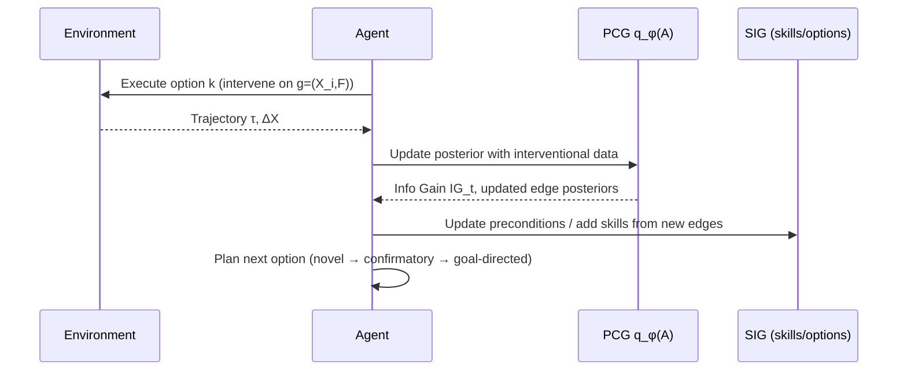

# Discover–Intervene–Adapt (DIA): Interpretable & Adaptive Causal RL

> A research codebase implementing the DIA paradigm: **Discover** causal structure, **Intervene** with learned skills, and **Adapt** policies—interleaved in one loop—to achieve **generalizable** and **explainable** behavior.

---

## Why DIA?

Modern RL often overfits to correlations and misses the **mechanisms** that generate outcomes. DIA integrates **causal discovery** with **hierarchical control**, so agents *learn why things work*, not just *what works*.

- **Interleaved learning**: structure learning and policy optimization proceed in tandem, each informing the other.
- **Probabilistic causal beliefs**: a **Probabilistic Causal Graph (PCG)** maintains a posterior over environment-variable dependencies.
- **Interventional skills**: a **Skill–Intervention Graph (SIG)** organizes options (skills) as interventions over those variables.
- **Rational exploration**: an **information-gain** bonus prioritizes novel, informative experiments during training.

---

## DIA at a glance

### System overview

```mermaid
flowchart LR
    subgraph Perception
      O[Observations] --> E[Encoder f_ψ]
      E --> X[Environment Variables X]
    end

    subgraph Causal Side
      X --> PCG[Probabilistic Causal Graph q_φ(A)]
      PCG --> IG[Information Gain I G_t]
      IG -->|intrinsic bonus| HL[High-Level Planner/Selector]
    end

    subgraph Control Side
      X --> HL
      HL -->|choose subgoal g=(X_i, F)| SIG[Skill–Intervention Graph]
      SIG --> OPT[Option Policy π_k]
      OPT --> ACT[Primitive Actions]
      ACT --> O
    end

    classDef dim fill:#f7f7f7,stroke:#bbb,color:#333;
    class Perception,Causal Side,Control Side dim;
```

**Key idea:** the planner chooses **which subgoal to intervene on** (from the SIG), guided by uncertainty in the PCG. Executed interventions feed back as evidence to update the PCG, creating a **closed scientific loop**.

---

## Core concepts

- **Environment‑Variable Goal Space (EVGS):** subgoals target interpretable variable changes *(e.g., `has_key↑`, `door_open=v1`)*. Options (skills) are trained to achieve a specific predicate over a variable.
- **PCG (q_φ(A))**: maintains uncertainty over edges in a DAG on environment variables; updated with interventional data; its **information gain** drives exploration.
- **SIG**: a directed graph over skills; edges encode **prerequisites** and **compatibilities** (what helps what), allowing **composable** plans.
- **Planner**: sequences options subject to SIG preconditions to achieve task goals; balances extrinsic reward and epistemic bonuses.

---

## What this repo provides

- **Modular library** in `src/dia/` for:
  - PCG learning & uncertainty metrics
  - Option (skill) training over EVGS
  - SIG construction & planning
  - Intrinsic reward via information gain
- **Experiment scaffolding** in `scripts/` for common domains (e.g., Atari/ProcGen/CausalWorld)  
- **Docs** in `docs/` (diagrams, figures, notes) and **tests** in `tests/`
- **Reproducible setup** via `environment.yml` and a simple `Makefile`  

---

## Method: from structure to skill—and back



- **Discover**: update causal beliefs from outcomes of executed options.  
- **Intervene**: select subgoals that **maximize expected information gain** when uncertainty is high.  
- **Adapt**: when beliefs stabilize, plan sequences over SIG to pursue the external task efficiently.

---

## Benchmarks & evaluation (high level)

DIA is designed for sparse, long‑horizon domains requiring structure and generalization (e.g., **Montezuma’s Revenge**, **ProcGen CoinRun**, **CausalWorld**, **2D‑Minecraft chains**, **CartPole (diagnostic)**).  
Typical measurements:
- **Return** on in‑distribution tasks
- **Generalization** to unseen seeds/configurations
- **Causal clarity**: PCG entropy decay / calibration
- **Option success & intervention precision**

(See the thesis for full protocol, figures, and tables.)

---

## Requirements (summary)

> Exact, pinned versions are provided in **`environment.yml`** at the repo root.

**Core**
- Python 3.9+  
- PyTorch (GPU recommended)  
- NumPy, SciPy  
- Matplotlib (and/or plotting libs)

**RL & environments**
- Gym/Gymnasium (classic control + wrappers for Atari)  
- ProcGen (CoinRun)  
- CausalWorld (+ PyBullet)  
- (Optional) Stable‑Baselines3 for PPO baselines/components

**Causal / graph & utils**
- Acyclic‑graph / structure‑learning utilities (e.g., linear‑algebra ops for differentiable DAG constraints)
- NetworkX (graph viz/ops), scikit‑learn (metrics, clustering), TensorBoard or Weights & Biases (logging)

**Utilities**
- tqdm, omegaconf/hydra (optional for config), pandas (optional for tabular metrics)

---

## Repository structure

```
.
├── src/dia/           # Core DIA library (PCG, SIG, options, planner, utils)
├── scripts/           # Experiment configs / launcher scripts
├── docs/              # Diagrams, figures, paper notes
├── tests/             # Unit and smoke tests
├── environment.yml    # Reproducible Conda/virtual env
├── Makefile           # Common developer tasks
└── README.md
```

---

## Recommendations & Next steps

1. **Drop in the README** above (this file).  
2. **Docs visuals**: add `docs/diagrams/` and keep Mermaid sources in the README so diagrams render on GitHub.  
3. **Requirements polish**: update `environment.yml` using the packages listed in the Requirements section.  
4. **API docstrings**: add short docstrings for `PCG` (posterior updates, info‑gain computation), `SIG` (add_skill, add_edge, prerequisites), `Option` training loop (targeting `(X_i, F)`), and `Planner` (selects next subgoal).  
5. **Metrics**: log TensorBoard scalars for **PCG entropy**, **edge calibration/ECE**, **option success rate**, **intervention precision**.  
6. **Checkpoints & reproducibility**: implement checkpointing for PCG state, SIG skills, and option policies; ensure seeding is configurable.

---

## Citing

If you use this codebase, please cite the thesis:

```bibtex
@mastersthesis{Jain2025DIA,
  title     = {Discover, Intervene, Adapt: Interpretable & Adaptive Causal RL via Interleaved Discovery and Structured Interventions},
  author    = {Lakshya Tushar Jain},
  school    = {Arizona State University},
  year      = {2025},
  month     = {December},
  note      = {Master of Science Thesis}
}
```

---

## License

MIT — see [`LICENSE`](./LICENSE).
```
